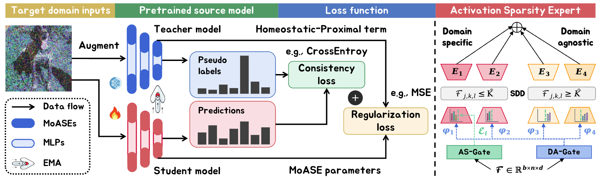

# Decomposing the Neurons: Activation Sparsity via Mixture of Experts for Continual Test Time Adaptation [**[Arxiv]**](https://arxiv.org/pdf/2405.16486)

Rongyu Zhang, Aosong Cheng*, Yulin Luo*, Gaole Dai, Huanrui Yang, Jiaming Liu, Ran Xu, Li Du, Yuan Du, Yanbing Jiang, Shanghang Zhang 



## Overview

Continual Test-Time Adaptation (CTTA), which aims to adapt the pre-trained model to ever-evolving target domains, emerges as an important task for vision models. As current vision models appear to be heavily biased towards texture, continuously adapting the model from one domain distribution to another can result in serious catastrophic forgetting. Drawing inspiration from the human visual system's adeptness at processing both shape and texture according to the famous Trichromatic Theory, we explore the integration of a Mixture-of-Activation-Sparsity-Experts (MoASE) as an adapter for the CTTA task. Given the distinct reaction of neurons with low/high activation to domain-specific/agnostic features, MoASE decomposes the neural activation into high-activation and low-activation components with a non-differentiable Spatial Differentiate Dropout (SDD). Based on the decomposition, we devise a multi-gate structure comprising a Domain-Aware Gate (DAG) that utilizes domain information to adaptive combine experts that process the post-SDD sparse activations of different strengths, and the Activation Sparsity Gate (ASG) that adaptively assigned feature selection threshold of the SDD for different experts for more precise feature decomposition. Finally, we introduce a Homeostatic-Proximal (HP) loss to bypass the error accumulation problem when continuously adapting the model. Extensive experiments on four prominent benchmarks substantiate that our methodology achieves state-of-the-art performance in both classification and segmentation CTTA tasks.


## Installation

Please create and activate the following conda envrionment. 
```bash
# It may take several minutes for conda to solve the environment
conda update conda
conda env create -f environment.yml
conda activate moase 
```

## Classification Experiments

* **ViT** as the backbone

Our source model is from timm, you can directly donwload it from the code.


### Cifar10-to-Cifar10C task 
Please load the source model from [here](https://drive.google.com/file/d/1pAoz4Wwos74DjWPQ5d-6ntyjQkmp9FPE/view?usp=sharing)

```bash
bash run_cifar10.sh # MoASE
```

### Cifar100-to-Cifar100C task 
Please load the source model from [here](https://drive.google.com/file/d/1yRekkpkIdwX_LFsOh4Ba9ndaECnY-UC-/view?usp=sharing)

```bash
cd cifar
bash run_cifar100.sh # MoASE
```

For segmentation code, you can refer to [cotta](https://github.com/qinenergy/cotta) and [SVDP](https://github.com/Anonymous-012/SVDP). As for the source model, you can directly use Segformer trained on Cityscapes.

## Citation
Please cite our work if you find it useful.
```bibtex
@article{zhang2024decomposing,
  title={Decomposing the Neurons: Activation Sparsity via Mixture of Experts for Continual Test Time Adaptation},
  author={Zhang, Rongyu and Cheng, Aosong and Luo, Yulin and Dai, Gaole and Yang, Huanrui and Liu, Jiaming and Xu, Ran and Du, Li and Du, Yuan and Jiang, Yanbing and others},
  journal={arXiv preprint arXiv:2405.16486},
  year={2024}
}
```

## Acknowledgement 
+ CoTTA code is heavily used. [official](https://github.com/qinenergy/cotta) 
+ KATANA code is used for augmentation. [official](https://github.com/giladcohen/KATANA) 
+ Robustbench [official](https://github.com/RobustBench/robustbench) 

## Data links
+ ImageNet-C [Download](https://zenodo.org/record/2235448#.Yj2RO_co_mF)

